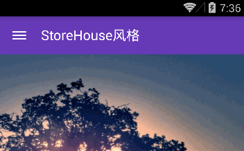
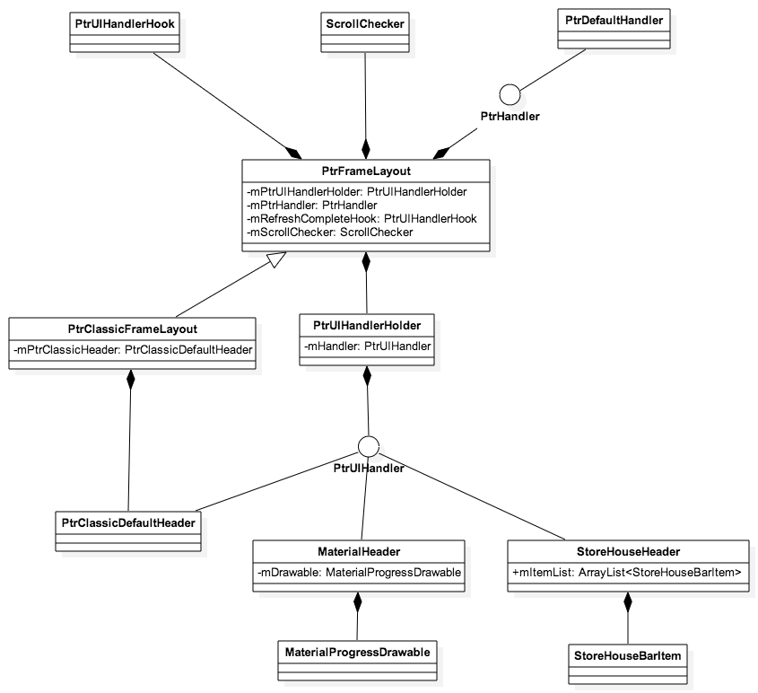
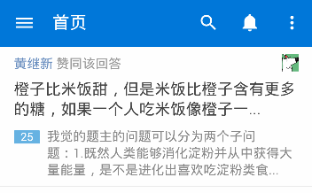
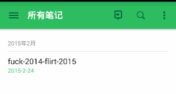

android-Ultra-Pull-To-Refresh 源码解析
====================================
> 本文为 [Android 开源项目源码解析](https://github.com/android-cn/android-open-project-analysis) 中 android-Ultra-Pull-To-Refresh 部分  
> 项目地址：[android-Ultra-Pull-To-Refresh](https://github.com/liaohuqiu/android-Ultra-Pull-To-Refresh)，分析的版本：[508c632](https://github.com/liaohuqiu/android-Ultra-Pull-To-Refresh/tree/508c63266de51ad8c010ac9912f7592b2f2da8fc)，Demo 地址：[android-Ultra-Pull-To-Refresh Demo](https://github.com/android-cn/android-open-project-demo/tree/master/android-ultra-pull-to-refresh-demo)    
> 分析者：[Grumoon](https://github.com/grumoon)，校对者：，校对状态：未完成   
 

###1. 功能介绍  
下拉刷新，几乎是每个Android应用都会需要的功能。android-Ultra-Pull-To-Refresh（以下简称 UltraPTR ）便是一个强大的Andriod下拉刷新框架。    
主要特点：  
(1).继承于 ViewGroup，Content 可以包含任何View。  
(2).简洁完善的 Header 抽象，方便进行拓展，构建符合需求的头部。
> 对比 [Android-PullToRefresh](https://github.com/chrisbanes/Android-PullToRefresh) 项目，UltraPTR 没有实现 **加载更多** 的功能，但我认为 **下拉刷新** 和 **加载更多** 不是同一层次的功能， **下拉刷新** 有更广泛的需求，可以适用于任何页面。而 **加载更多** 的功能应该交由具体的 Content 自己去实现。这应该是和Google官方推出 SwipeRefreshLayout 是相同的设计思路，但对比 SwipeRefreshLayout，UltraPTR 更灵活，更容易拓展。

###2. 总体设计
UltraPTR 总体设计比较简单清晰。  
首先抽象出了两个接口，功能接口和 UI 接口。  
PtrHandler 代表下拉刷新的功能接口，包含刷新功能回调方法以及判断是否可下拉的方法。用户实现此接口来进行数据刷新工作。   
PtrUIHandler 代表下拉刷新的 UI 接口，包含准备下拉，下拉中，下拉完成，重置以及下拉过程中的位置变化等回调方法。通常情况下， Header 需要实现此接口，来处理下拉刷新过程中的头部 UI 的变化。        
整个项目围绕核心类 PtrFrameLayout 。 PtrFrameLayout 代表了一个下拉刷新的自定义控件。    
PtrFrameLayout 继承自 ViewGroup ，有且只能有两个子 View ，头部 Header 和内容 Content 。通常情况是 Header 会实现 PtrUIHandler 接口，Content 可以为任意的 View 。  
和所有的自定义控件一样， UltraPTR 通过重写 onFinishInflate ， onMeasure ， onLayout 来确定控件大小和位置。通过重写 dispatchTouchEvent 来确定控件的下拉行为。

###3. 流程图
主要功能流程图  
- 如 Retrofit、Volley 的请求处理流程，Android-Universal-Image-Loader 的图片处理流程图  
- 可使用 StartUML、Visio 或 Google Drawing 等工具完成，其他工具推荐？？  
- 非所有项目必须，不需要的请先在群里反馈  

**完成时间**  
- `两天内`完成  


###4. 详细设计
###4.1 核心类功能介绍

####4.1.1 PtrHandler.java
下拉刷新功能接口，对下拉刷新功能的抽象。  
```java
public void onRefreshBegin(final PtrFrameLayout frame)
```  
刷新回调函数，用户在这里写自己的刷新功能实现。  

```java
public boolean checkCanDoRefresh(final PtrFrameLayout frame, final View content, final View header)
```
判断是否可以下拉刷新。UltraPTR 的 Content 可以包含任何内容，用户在这里判断决定是否可以下拉。  
例如，如果 Content 是 TextView ，则可以直接返回 true，表示可以下拉刷新。  
如果 Content 是 ListView ，则第一条在顶部时返回 true，表示可以下拉刷新。  
如果 Content 是 ScrollView ，则滑动到顶部时返回 true ，表示可以刷新。  

####4.1.2 PtrDefaultHandler.java
抽象类，实现了 PtrHandler.java 接口，给出了 `checkCanDoRefresh` 默认实现。  
```java
@Override
public boolean checkCanDoRefresh(PtrFrameLayout frame, View content, View header) {
	return checkContentCanBePulledDown(frame, content, header);
}

public static boolean checkContentCanBePulledDown(PtrFrameLayout frame, View content, View header) {
    /**
     * 如果Content不是ViewGroup，返回true,表示可以下拉</br>
     * 例如：TextView，ImageView
     */
    if (!(content instanceof ViewGroup)) {
        return true;
    }

    ViewGroup viewGroup = (ViewGroup) content;

    /**
     * 如果Content没有子View（内容为空）时候，返回true，表示可以下拉
     */
    if (viewGroup.getChildCount() == 0) {
        return true;
    }

    /**
     * 如果Content是AbsListView（ListView，GridView），当第一个item不可见是，返回false，不可以下拉。
     */
    if (viewGroup instanceof AbsListView) {
        AbsListView listView = (AbsListView) viewGroup;
        if (listView.getFirstVisiblePosition() > 0) {
            return false;
        }
    }

    /**
     * 如果SDK版本为14以上，可以用canScrollVertically判断是否能在竖直方向上，向上滑动</br>
     * 不能向上，表示已经滑动到在顶部或者Content不能滑动，返回true，可以下拉</br>
     * 可以向上，返回false，不能下拉
     */
    if (Build.VERSION.SDK_INT >= 14) {
        return !content.canScrollVertically(-1);
    } else {
        /**
         * SDK版本小于14，如果Content是ScrollView或者AbsListView,通过getScrollY判断滑动位置 </br>
         * 如果位置为0，表示在最顶部，返回true，可以下拉
         */
        if (viewGroup instanceof ScrollView || viewGroup instanceof AbsListView) {
            return viewGroup.getScrollY() == 0;
        }
    }

    /**
     * 最终判断，判断第一个子View的top值</br>
     * 如果第一个子View有margin，则当top==子view的marginTop+content的paddingTop时，表示在最顶部，返回true，可以下拉</br>
     * 如果没有margin，则当top==content的paddinTop时，表示在最顶部，返回true，可以下拉
     */
    View child = viewGroup.getChildAt(0);
    ViewGroup.LayoutParams glp = child.getLayoutParams();
    int top = child.getTop();
    if (glp instanceof ViewGroup.MarginLayoutParams) {
        ViewGroup.MarginLayoutParams mlp = (ViewGroup.MarginLayoutParams) glp;
        return top == mlp.topMargin + viewGroup.getPaddingTop();
    } else {
        return top == viewGroup.getPaddingTop();
    }
}

```
这里特别注意一下，以上代码中存在一些小bug。[Issue](https://github.com/liaohuqiu/android-Ultra-Pull-To-Refresh/issues/30)
```java
if (viewGroup instanceof ScrollView || viewGroup instanceof AbsListView) {
    return viewGroup.getScrollY() == 0;
}
```
如果 Content 是AbsListView（ListView，GridView），通过getScrollY（）获取的值一直是0，所以这段代码的判断，无效。
####4.1.3 PtrUIHandler.java
下拉刷新，UI事件接口
####4.1.4 PtrUIHandlerHolder.java
封装了PtrUIHandler.java的链表
####4.1.5 PtrFrameLayout.java
下拉刷新实现类
####4.1.6 PtrClassicFrameLayout.java
继承PtrFrameLayout.java，经典下拉刷新实现类
  
####4.1.7 PtrClassicDefaultHeader.java
经典下拉刷新实现类的头部实现
####4.1.8 PtrUIHandlerHook.java
####4.1.9 MaterialHeader.java
Material Design风格的头部实现  

####4.1.10 MaterialProgressDrawable.java
####4.1.11 StoreHouseHeader.java
StoreHouse风格的头部实现  

####4.1.12 StoreHouseBarItem.java
####4.1.13 StoreHousePath.java
####4.1.14 PtrLocalDisplay.java
显示相关工具类  
  
###4.2 类关系图



###5. 杂谈
####5.1优点
刷微博，刷朋友圈，已经成为很多人的习惯，现在的应用，几乎所有的用户主动刷新操作，都是通过下拉刷新来完成。  
所以一个精心设计的下拉刷新头部，可以让你的应用眼前一亮。UltraPTR对头部的抽象，可以是用户随意定制自己的头部，来实现各种效果。  
  
####5.2期望
  
希望增加更加灵活的行为，可以应对诸如这样的需求。总结起来，就是更加抽象Header和Content在针对下拉时候的行为。
例如  
知乎  
  
Evernote  
    
####5.3关于加载更多
UltraPTR 没有集成加载更多的功能。项目的 Issue 里面也有人提到希望加入这个功能。  
[希望加入下拉加载········ #35](https://github.com/liaohuqiu/android-Ultra-Pull-To-Refresh/issues/35)  
[要是把上拉加载更多 集成进去，就无敌了 #8](https://github.com/liaohuqiu/android-Ultra-Pull-To-Refresh/issues/8)  
作者给予了回复，认为下拉刷新和加载更多，不能同一个层级的功能。加载更多不应该由 UltraPTR 去实现，而应该有 Content 自己去实现。  
我也觉得这样是合适的，UltraPTR 的强大之处，就是它的 Content 可以是任何的 View 。因为刷新的动作，可以在任何的 View 上进行，比如一个 TextView ，一个 ImageView ，一个 WebView 或者一个 LineaerLayout 布局中。而加载更多的功能，很多时候是用在了例如 ListView，GridView等上面，而大部分的 View 不会需要这个功能。所以交由 ListView或者GridView自己去实现比较好些。   


  

